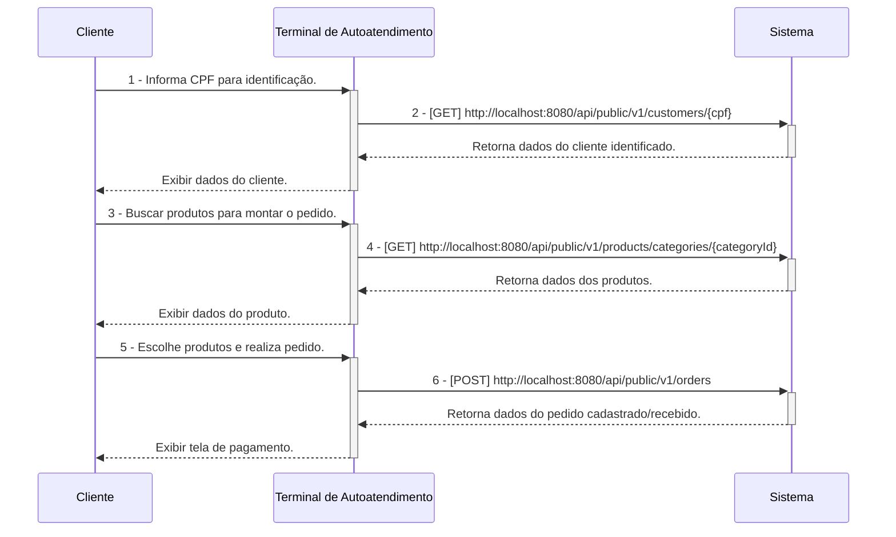
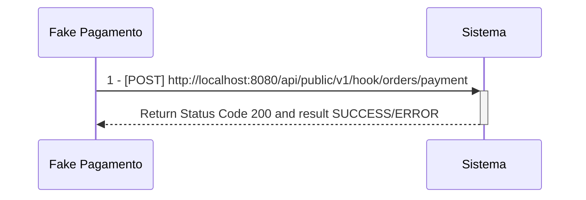
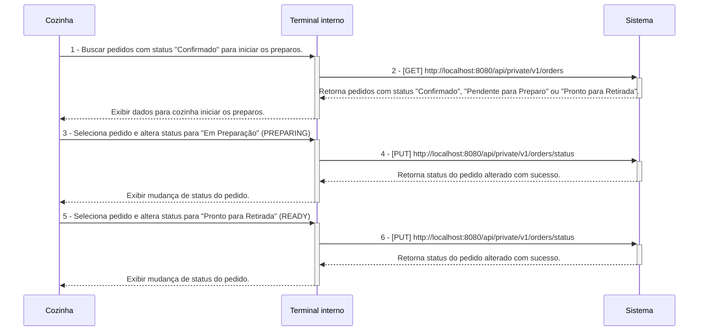
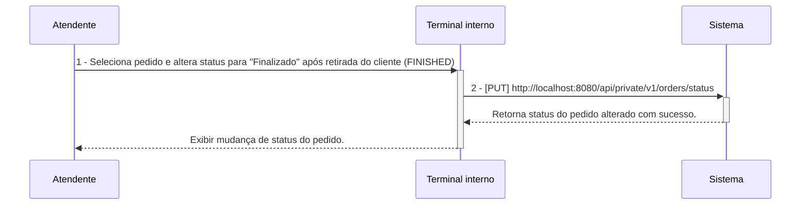

# Tech Challenge Backend API

## O Desafio :triangular_flag_on_post:

Uma lanchonete de bairro está em expansão devido ao seu grande sucesso. Entretanto, com essa expansão e a ausência de um
sistema de controle de pedidos, o atendimento aos clientes pode tornar-se caótico e confuso. Por exemplo, imagine que um
cliente faça um pedido complexo, como um hambúrguer personalizado com ingredientes específicos, acompanhado de batatas
fritas e uma bebida. O atendente pode anotar o pedido em um papel e entregá-lo à cozinha, mas não há garantia de que o
pedido será preparado corretamente.

Sem um sistema de controle de pedidos, pode haver confusão entre os atendentes e a cozinha, resultando em atrasos na
preparação e entrega dos pedidos. Pedidos podem ser perdidos, mal interpretados ou esquecidos, levando à insatisfação
dos clientes e à perda de negócios.

Em resumo, um sistema de controle de pedidos é essencial para garantir que a lanchonete possa atender os clientes de
maneira eficiente, gerenciando seus pedidos e estoques de forma adequada. Sem ele, a expansão da lanchonete pode não ser
bem-sucedida, resultando em clientes insatisfeitos e impactando negativamente os negócios.

Para solucionar o problema, a lanchonete irá investir em um sistema de autoatendimento de fast food, composto por uma
série de dispositivos e interfaces que permitem aos clientes selecionar e fazer pedidos sem precisar interagir com um
atendente, com as seguintes funcionalidades:

1. **Pedido**
    - Os clientes são apresentados a uma interface de seleção na qual podem optar por se identificarem via CPF, se
      cadastrarem com nome e e-mail, ou não se identificar. A montagem do combo segue a sequência a seguir, sendo todas
      as etapas opcionais:
        - Lanche
        - Acompanhamento
        - Bebida
        - Sobremesa

**Em cada etapa, são exibidos o nome, descrição e preço de cada produto.**

2. **Pagamento**
    - O sistema deverá possuir uma opção de pagamento integrada para o MVP, sendo a forma de pagamento oferecida via
      QRCode do Mercado Pago.
    - Nesse MVP, será realizado um `fake checkout` para o fluxo de pagamento, sem integração direta com o Mercado Pago.

3. **Acompanhamento**
    - Uma vez que o pedido é confirmado e pago, ele é enviado para a cozinha para ser preparado. Simultaneamente, deve
      aparecer em um monitor para o cliente acompanhar o progresso do seu pedido com as seguintes etapas:
        - Recebido
        - Em preparação
        - Pronto
        - Finalizado

4. **Entrega**
    - Quando o pedido estiver pronto, o sistema deverá notificar o cliente que ele está disponível para retirada. Ao ser
      retirado, o pedido deve ser atualizado para o status finalizado.

**Além das etapas do cliente, o estabelecimento precisa de um acesso administrativo:**

1. **Gerenciar clientes**
    - Com a identificação dos clientes, o estabelecimento pode trabalhar em campanhas promocionais.

2. **Gerenciar produtos e categorias**
    - Os produtos dispostos para escolha do cliente serão gerenciados pelo estabelecimento, definindo nome, categoria,
      preço, descrição e imagens. Para esse sistema, teremos categorias fixas:
        - Lanche
        - Acompanhamento
        - Bebida
        - Sobremesa

3. **Acompanhamento de pedidos**
    - Deve ser possível acompanhar os pedidos em andamento e o tempo de espera de cada pedido.

As informações dispostas no sistema de pedidos precisarão ser gerenciadas pelo estabelecimento através de um painel
administrativo.

## Equipe :construction_worker:

- Myller Lobo
- Jean Carlos
- Caio Isikawa
- Vanderly
- Thiago

## Pré-Requisitos :exclamation:

- Maven 3
- Java 17 (Open JDK 17)
- Postgres 15
- Docker Desktop
- IntelliJ IDEA
- DBeaver SQL Client
- Postman

---

## Configuração de Ambiente de Desenvolvimento Local  :heavy_check_mark:

[Clique aqui para ser redirecionado para a wiki de configuração do ambiente de desenvolvimento local](https://github.com/fiap-8soat-tc-one/tc-backend/blob/main/docs/config/README.md)

## Configuração do Ambiente Docker/Docker Compose :heavy_check_mark:

- **A aplicação está configurada para o Flyway gerar as tabelas no PostgreSQL. Abra o DBeaver ou a ferramenta de sua
  escolha e verifique se as tabelas do sistema foram criadas.**

[Clique aqui para ser redirecionado para a wiki de configuração do ambiente Docker](https://github.com/fiap-8soat-tc-one/tc-backend/blob/main/docs/docker/README.md)

## Manual/Documentação de Funcionalidades (Swagger/Open API) :heavy_check_mark:

- **Para todos os endpoints privados, é necessário gerar o token via endpoint login(POST /oauth/token)**

- **É possível acessar o Swagger/Open API da aplicação pela seguinte URL: `http://localhost:8080/swagger-ui/index.html`
  **

### Workflow de Execução das APIs

**Segue abaixo o descritivo simplificado da jornada das APIs dentro do sistema, esses diagramas servem apenas para
materializar a jornada do ClienteXTerminalxSistemaXCozinha, mas em nenhum momento substitui o detalhamento/especificação
realizados no Domain Storytelling e Event Storming criados, favor utiliza-los como fonte da verdade**

1 - **Criação do Pedido a partir de um cliente identificado**

**Observação:**

- **Os fluxos de 1 a 2 são opicionais.**
- **Não é necessário informar campo id_customer no payload do POST v1/orders uma vez que esse campo é opcional com base
  na escolha do usuário se identificar ou não.**

---

3 - **Pagamento do Pedido**

---

4 - **Acompanhamento e Preparação de Pedido na Cozinha**

---

5 - **Finalização do pedido**

[Clique aqui para ser redirecionado para a documentação das APIs e suas funcionalidades](https://documenter.getpostman.com/view/7393190/2sA3kd9cgG)

## Domain Storytelling :heavy_check_mark:

[Clique aqui para ser redirecionado para a documentação do domain storytelling](https://miro.com/app/board/uXjVKuUez2Q=/)

## Dicionário de Linguagem Onipresente/Ubíqua

| Palavra                         | Descrição                                                                                                                                                                                                    |
|---------------------------------|--------------------------------------------------------------------------------------------------------------------------------------------------------------------------------------------------------------|
| Lanchonete                      | Estabelecimento onde a solução/sistema será aplicado.                                                                                                                                                        |
| Cliente                         | Pessoa que realiza pedidos na lanchonete.                                                                                                                                                                    |
| Cozinha                         | Setor da lanchonete responsável por preparar todos os produtos do combo.                                                                                                                                     |
| Administrador/Usuário Sistêmico | Pessoa que cadastra produtos no sistema.                                                                                                                                                                     |
| Sistema de Controle de Pedidos  | Sistema que soluciona o problema da lanchonete, automatizando a coleta de pedidos, pagamento e comunicação com a cozinha.                                                                                    |
| Monitor/Terminal                | No Contexto da Cozinha: Display onde são exibidos os pedidos na cozinha pendentes de preparo. No Contexto do Cliente: Display onde o cliente consegue acompanhar o status dos seus pedidos.                  |
| Promoção                        | Oferta de produtos com desconto customizada por cliente.                                                                                                                                                     |
| Pagamento                       | Ação realizada pelo cliente ao fazer a leitura do QR code do Mercado Pago para realizar o pagamento do pedido.                                                                                               |
| Pedido                          | Pedido de combo realizado pelo cliente.                                                                                                                                                                      |
| RECEIVED/Pedido Recebido        | Pedido aguardando pagamento pelo cliente)                                                                                                                                                                    |
| CONFIRMED/Pedido Confirmado     | Status do pedido após a conclusão do pagamento e encaminhamento para a cozinha.                                                                                                                              |
| PEDING/Pedido Pendente          | Status do pedido após uma falha no fluxo de pagamento.                                                                                                                                                       |
| PREPARING/Pedido Em Preparação  | Status do pedido após a cozinha iniciar o preparo.                                                                                                                                                           |
| READY/Pedido Pronto             | Status do pedido após a cozinha terminar o preparo e disponibilizar para retirada pelo cliente.                                                                                                              |
| FINISHED/Pedido Finalizado      | Status do pedido após ser retirado pelo cliente.                                                                                                                                                             |
| CANCELED/Pedido Cancelado       | Status do pedido após ser cancelado pelo cliente ou pela cozinha.                                                                                                                                            |
| Acompanhamento                  | No Contexto de Itens do Pedido: Item que acompanha o hambúrguer, como, por exemplo, batata frita. No Contexto do Pedido: Funcionalidade que permite ao cliente acompanhar o status do seu pedido no monitor. |

## Event Storming :heavy_check_mark:

[Clique aqui para ser redirecionado para a documentação do event storming](https://miro.com/app/board/uXjVK1Bf4Q4=/)

## Domain Mapping :heavy_check_mark:

## Requisitos não funcionais a serem implementados no futuro

- Testes de Unidade.
- Testes de Integração.
- Testes de Carga/Estresse.
- Cadastro de usuário sistêmico.
