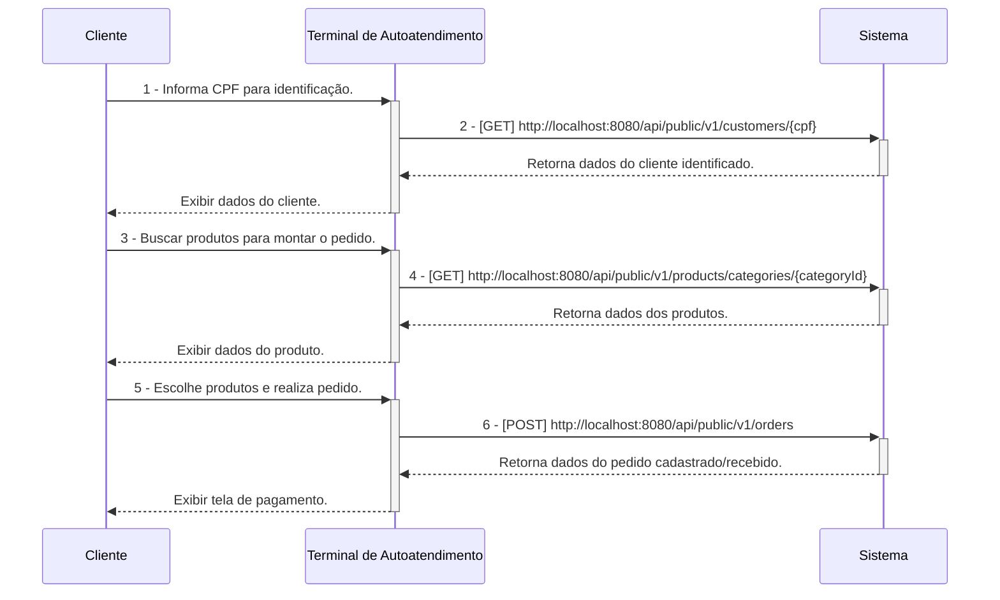
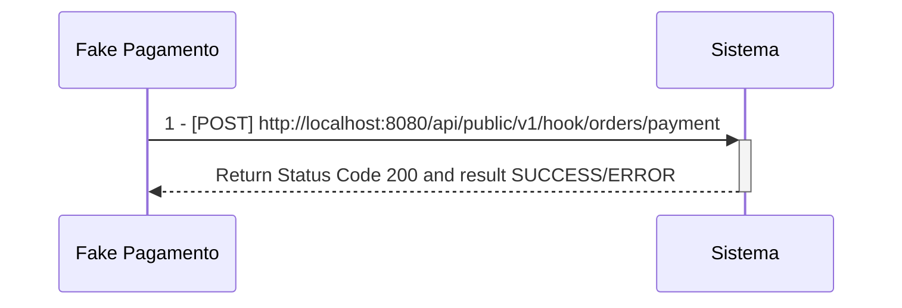
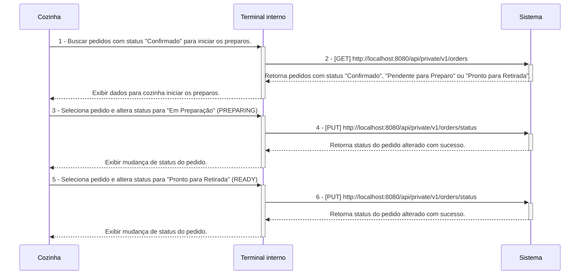
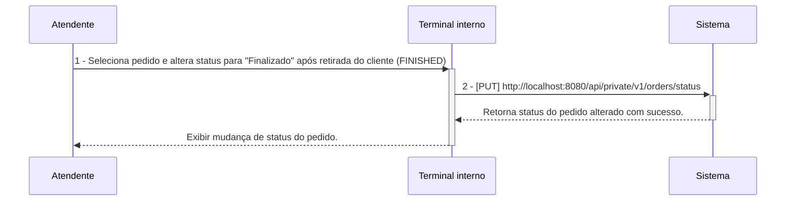

# Tech Challenge Backend API

## O Desafio :triangular_flag_on_post:

Uma lanchonete de bairro está em expansão devido ao seu grande sucesso. Entretanto, com essa expansão e a ausência de um sistema de controle de pedidos, o atendimento aos clientes pode tornar-se caótico e confuso. Por exemplo, imagine que um cliente faça um pedido complexo, como um hambúrguer personalizado com ingredientes específicos, acompanhado de batatas fritas e uma bebida. O atendente pode anotar o pedido em um papel e entregá-lo à cozinha, mas não há garantia de que o pedido será preparado corretamente.

Sem um sistema de controle de pedidos, pode haver confusão entre os atendentes e a cozinha, resultando em atrasos na preparação e entrega dos pedidos. Pedidos podem ser perdidos, mal interpretados ou esquecidos, levando à insatisfação dos clientes e à perda de negócios.

Em resumo, um sistema de controle de pedidos é essencial para garantir que a lanchonete possa atender os clientes de maneira eficiente, gerenciando seus pedidos e estoques de forma adequada. Sem ele, a expansão da lanchonete pode não ser bem-sucedida, resultando em clientes insatisfeitos e impactando negativamente os negócios.

Para solucionar o problema, a lanchonete irá investir em um sistema de autoatendimento de fast food, composto por uma série de dispositivos e interfaces que permitem aos clientes selecionar e fazer pedidos sem precisar interagir com um atendente, com as seguintes funcionalidades:

1. **Pedido**
    - Os clientes são apresentados a uma interface de seleção na qual podem optar por se identificarem via CPF, se cadastrarem com nome e e-mail, ou não se identificar. A montagem do combo segue a sequência a seguir, sendo todas as etapas opcionais:
        - Lanche
        - Acompanhamento
        - Bebida
        - Sobremesa

**Em cada etapa, são exibidos o nome, descrição e preço de cada produto.**

2. **Pagamento**
    - O sistema deverá possuir uma opção de pagamento integrada para o MVP, sendo a forma de pagamento oferecida via QRCode do Mercado Pago.
    - Nesse MVP, será realizado um `fake checkout` para o fluxo de pagamento, sem integração direta com o Mercado Pago.

3. **Acompanhamento**
    - Uma vez que o pedido é confirmado e pago, ele é enviado para a cozinha para ser preparado. Simultaneamente, deve aparecer em um monitor para o cliente acompanhar o progresso do seu pedido com as seguintes etapas:
        - Recebido
        - Em preparação
        - Pronto
        - Finalizado

4. **Entrega**
    - Quando o pedido estiver pronto, o sistema deverá notificar o cliente que ele está disponível para retirada. Ao ser retirado, o pedido deve ser atualizado para o status finalizado.

**Além das etapas do cliente, o estabelecimento precisa de um acesso administrativo:**

1. **Gerenciar clientes**
    - Com a identificação dos clientes, o estabelecimento pode trabalhar em campanhas promocionais.

2. **Gerenciar produtos e categorias**
    - Os produtos dispostos para escolha do cliente serão gerenciados pelo estabelecimento, definindo nome, categoria, preço, descrição e imagens. Para esse sistema, teremos categorias fixas:
        - Lanche
        - Acompanhamento
        - Bebida
        - Sobremesa

3. **Acompanhamento de pedidos**
    - Deve ser possível acompanhar os pedidos em andamento e o tempo de espera de cada pedido.

As informações dispostas no sistema de pedidos precisarão ser gerenciadas pelo estabelecimento através de um painel administrativo.

## Equipe :construction_worker:

- Myller Lobo
- Jean Carlos
- Caio Isikawa
- Vanderly
- Thiago

## Pré-Requisitos :exclamation:

- Maven 3
- Java 17 (Open JDK 17)
- Postgres 15
- Docker Desktop
- IntelliJ IDEA
- DBeaver SQL Client
- Postman

---

## Configuração de Ambiente de Desenvolvimento Local  :heavy_check_mark:

[Clique aqui para ser redirecionado para a wiki de configuração do ambiente de desenvolvimento local](https://github.com/fiap-8soat-tc-one/tc-backend/blob/main/docs/config/README.md)

## Configuração do Ambiente Docker/Docker Compose :heavy_check_mark:

- **A aplicação está configurada para o Flyway gerar as tabelas no PostgreSQL. Abra o DBeaver ou a ferramenta de sua escolha e verifique se as tabelas do sistema foram criadas.**

[Clique aqui para ser redirecionado para a wiki de configuração do ambiente Docker](https://github.com/fiap-8soat-tc-one/tc-backend/blob/main/docs/docker/README.md)

## Manual/Documentação de Funcionalidades (Swagger/Open API) :heavy_check_mark:

- **Para todos os endpoints privados, é necessário gerar o token via endpoint login(POST /oauth/token)**

- **É possível acessar o Swagger/Open API da aplicação pela seguinte URL: `http://localhost:8080/swagger-ui/index.html`**

### Workflow de Execução das APIs

**Segue abaixo o descritivo simplificado da jornada das APIs dentro do sistema, esses diagramas servem apenas para materializar a jornada do ClienteXTerminalxSistemaXCozinha, mas em nenhum momento substitui o detalhamento/especificação realizados no Domain Storytelling e Event Storming criados, favor utiliza-los como fonte da verdade**

1 - **Criação do Pedido a partir de um cliente identificado**

**Observação:**

- **Os fluxos de 1 a 2 são opicionais.**
- **Não é necessário informar campo id_customer no payload do POST v1/orders uma vez que esse campo é opcional com base na escolha do usuário se identificar ou não.**

---

3 - **Pagamento do Pedido**

---

4 - **Acompanhamento e Preparação de Pedido na Cozinha**

---

5 - **Finalização do pedido**

[Clique aqui para ser redirecionado para a documentação das APIs e suas funcionalidades](https://documenter.getpostman.com/view/37556926/2sA3s1oXsw)

## Domain Storytelling :heavy_check_mark:

[Clique aqui para ser redirecionado para a documentação do domain storytelling](https://miro.com/app/board/uXjVKuUez2Q=/)

## Dicionário de Linguagem Onipresente/Ubíqua

| Palavra                         | Descrição                                                                                                                                                                                                    |
|---------------------------------|--------------------------------------------------------------------------------------------------------------------------------------------------------------------------------------------------------------|
| Lanchonete                      | Estabelecimento onde a solução/sistema será aplicado.                                                                                                                                                        |
| Cliente                         | Pessoa que realiza pedidos na lanchonete.                                                                                                                                                                    |
| Cozinha                         | Setor da lanchonete responsável por preparar todos os produtos do combo.                                                                                                                                     |
| Administrador/Usuário Sistêmico | Pessoa que cadastra produtos no sistema.                                                                                                                                                                     |
| Sistema de Controle de Pedidos  | Sistema que soluciona o problema da lanchonete, automatizando a coleta de pedidos, pagamento e comunicação com a cozinha.                                                                                    |
| Monitor/Terminal                | No Contexto da Cozinha: Display onde são exibidos os pedidos na cozinha pendentes de preparo. No Contexto do Cliente: Display onde o cliente consegue acompanhar o status dos seus pedidos.                  |
| Promoção                        | Oferta de produtos com desconto customizada por cliente.                                                                                                                                                     |
| Pagamento                       | Ação realizada pelo cliente ao fazer a leitura do QR code do Mercado Pago para realizar o pagamento do pedido.                                                                                               |
| Pedido                          | Pedido de combo realizado pelo cliente.                                                                                                                                                                      |
| RECEIVED/Pedido Recebido        | Pedido aguardando pagamento pelo cliente)                                                                                                                                                                    |
| PENDING/Pedido Pendente          | Status do pedido após uma falha no fluxo de pagamento.                                                                                                                                                       |
| PREPARING/Pedido Em Preparação  | Status do pedido após a após a conclusão do pagamento e encaminhamento para a cozinha iniciar o preparo.                                                                                                                                                           |
| READY/Pedido Pronto             | Status do pedido após a cozinha terminar o preparo e disponibilizar para retirada pelo cliente.                                                                                                              |
| FINISHED/Pedido Finalizado      | Status do pedido após ser retirado pelo cliente.                                                                                                                                                             |
| CANCELED/Pedido Cancelado       | Status do pedido após ser cancelado pelo cliente ou pela cozinha.                                                                                                                                            |
| Acompanhamento                  | No Contexto de Itens do Pedido: Item que acompanha o hambúrguer, como, por exemplo, batata frita. No Contexto do Pedido: Funcionalidade que permite ao cliente acompanhar o status do seu pedido no monitor. |

## Event Storming :heavy_check_mark:

[Clique aqui para ser redirecionado para a documentação do event storming](https://miro.com/app/board/uXjVK1Bf4Q4=/)

## Domain Mapping :heavy_check_mark:

## Desenho de Arquitetura/Infraestrutura  proposto  :heavy_check_mark:

[Clique aqui para ser redirecionado para o desenho de arquitetura e infraestrutura](https://viewer.diagrams.net/?tags=%7B%7D&lightbox=1&highlight=0000ff&edit=_blank&layers=1&nav=1&title=tc-backend.drawio.png#R%3Cmxfile%20scale%3D%221%22%20border%3D%220%22%3E%3Cdiagram%20name%3D%22Draft%22%20id%3D%22jiXIkiBsy346j2COqR-b%22%3E7Vxbc6O4Ev41qZp5sAuJm3l0nHgztZnabDJ75pynKQyKzQYjlksu8%2Bu3JRBGIAdnArZnjp3EgUYSovvri1oSZ%2Fps%2Ffxb4sarz9Qn4RnW%2FOcz%2FeIMY2ui2fCPUV4KCrYNvaAsk8AvaNqGcBd8JwURCWoe%2BCQtaQUpozTMglgmejSKiJdJNDdJ6JNc7J6GvkSI3SWRusEId54bklaxr4GfrQrqBNsb%2BhUJlitxZ2Q5xZW1KwqXDacr16dPNZJ%2BeabPEkqz4mj9PCMh457Ml%2FmWq1XHEhJlu1Qg089Xf96dO4vn%2FPoqmjnfI%2B3vkVk28%2BiGefnEZW%2BzF8GChOaRT1gr2pl%2B%2FrQKMnIXux67%2BgRSB9oqW4dwhuAwzRL6QGY0pAlQIhpBsfPyHiTJyPPW3qOKJ4AmQtckS16gSFlhZOplnRJJIzyxCsLTRi7Y1kviqiYUjOyS6pZoWFbtbxgGByXP3sA%2Fw34L%2FxiD3MQrUY4YO303XVW8vQ%2FCULDuDOtzk%2F1UTBX404GyDN00FbVolNVqFZ%2BWKOCKxT%2BsduL6AdnU6lFMhuFIYsKCQ3UpWchuSwmZDhpKSm9G%2BTYpoYaUSs61BdRivsY%2FpbjuyvuiHlgOEpc4bttOi%2BOoarfO8YltDsRw3W7xl%2FhgV8tTmmQruqSRG15uqOeyBDZlrimNS9b%2FTbLspRSMm2dUZXvqUrgP6dM0CsAWBzQqSxU9Y915neHQe5onHnnlMXHJv8xNliR7jR%2BWWoQJCaFrj3JPepeG6ObuRqrDyCc0Exx1WurRYazaytODDiAN6WNLUgOEDX1stjTBMPWxUBDJR%2BjGQNx3jkMVeoS9%2BU4wl1VvaAB33siw6eAtZ9ywT4WelfUaYqk68uOSepOa7BALNdz5vcl%2BfshhdyhYH45bN7DMfmShtudGWOG4J%2FpQhqtbIBBVx%2BwQbDxDdp39jB8BRPLTMFgyU5Ux3amo1%2B6ChDc0DUpDtqBZRtdQIGQXzl3vYcmFXRcg%2F0ARfrNpGhcDDh4viJP74JkJ6rzsz8Uqy9hIZcoYgeeeHxnjAMYq9wHAKBl7cEc8993MhX%2BMnjI%2BBfloEUIHRin1AjdkbJhbENzPl0G2yhcjhCfjOFoOBwXTbkBh0oaCoQi0jaHCbL0FhN%2BC7CpfAG3qMQGmLWDA82cyHtwSBx7wgSQKgKwD3%2BfmV6XXsubzIK4wvrgd1A0mGGQ1BIMnbR3VjLZkdG0gyRhvV9Ef1UCf3Lt5mG3VbLUOSmqq1spHKECTlJCHUiGf4hHoYsbEgud5HFLXZ4qJNQxAnGvg0ecF%2FkYl%2BkbX4J9H%2F%2BHtjNPH5WhY%2FdTNBgzEEKAe8iNFxF8Re8eB1cLB7BM0NIMj7SaISRhArPd%2FoaMtP2rs5kYHU9EdUhQxC6n4fc1z%2BNXGDGEzjf%2BZUGDGic6EEcYsZ1Sj87OxjRqFLbjtrEEsSjqmgmpVRPjdwUakDyTzVqWkO51%2ByzS0cMY5QJLLR1IwggOkNFzr5yXLbo69IPUocsZ5yqs0wjtNMzW7HcZtzRD0ADYHOQ2sWW2wIcNUGAJjqKG%2FSNzW4HZLlgE8P8Q42idmgMHEahGFrxlopAuGIYHjstDLIYzE4EbBacoJtf02chR%2B2xjKKAhHIFkFi3tXiKqsZcafvCAwHkkysf7JqbgwSrmJBVeqAUuei2rlddHQBfUeuJCv%2FqoahV4X7cr3AnLt%2Fj97sK91BvtliL8mfuCOMGKx2xwb1YVv%2FMI36SSEWOObz1k69FAA6ZOmM8Nt4IogVDIwgtg%2FclWjwp6A%2Blean830sylKApp2INUPHt91r946%2FeErAZWZf6EZs6zzz3QRQEswMorjj93axh9ji779AqZ3YukNBLez49hUTEdYQ%2BUD0UFy46pMuGrWwk2yKZs2ZTJmadvAE%2BR5EIrGznbOJXZmxtF7M%2BPqZKKhySkMEzVyVEWSc7BUIlKNi3vS95af%2FhQtE5KCvdI%2BuxF4Il%2FtTH8Oa9Z6umsYfUMFMD1u5LEo4s3P1mHlpKFEcySkGAZh1dhIRbPbRNQu1h4mFXdoElU0u01EW4ZdWDXqUtFss93jZm2kqI0atfk4juYZG%2FnPqtUZiglr%2BJkz1WoOqC4vbMRnTFt58So2k2bPO4O9LWPDpkurW81NCgHCDtllKSPB5pDRfUqNMSgntzafPNafczgtjuRSYPBS6N43lm36tuBoD4aL7HRdHpLoijQFUi2mqIj9O0bzEI4R%2BJW8%2FJfVH5vi9H9lc%2Fzk4lk6e6mf3ZAkgIdnsLnQlKJS%2B92evWznjJ2ImbvdsfFOd%2Fw%2BBBzJXOlehNYti8leQiOwsY1Qd%2BjYqJ0r3kNs9IaooQHBtpHfknuUvBEf%2F6Ty%2BOcHPVTDL7J1O5f4Vb%2FYyudqmlmkWfVGBFG692amV0lV5oSdLQ3bvPbYcXYIY%2FCkUZbHDk1f%2BpAvSBKBtU15VoVxIE5KT7pHTznBO3tKeNqhnKXoxKFNZc19GnblT5kDRWMNVSXe4kQHXrQlUq%2Bd9he%2Fd53L%2B3zhZI9W8o4kjwFwTdCTKrfkxvEo80YL13sgkT9K8Sh99D6ezOmvbU5Bxvsypwjbisnr%2FdvT9rTVCbk%2FD3I3JM7SUg4VnlexOxSeERaLowSgTTEFelhA73OC7%2BaPi67pklcn9k6adbSaVelQTP3BdAjZmqxDunEUQbZqqvEE3RN0X4NuteHvsNBtL5k9QfcE3Q7oHkcorsoPnqD7s0C3IxT3SRzSl%2F1F45rY%2B3tYTKsW4RaBMeAxelfwfUtAFmz232erfm5pRtw1sIvWIu%2FiHooZf5n07q58uKV5xnKx0I88JOnHjj4c1fqj2q7G5k7FzdaD3fZulYt%2Bu%2FZFDrYNGxvGWOz6FIqANKPCd00XdGyKbXZ1bXCGWniKt%2Bc1e9CEf%2FIgDfgSPpt9n5uEKcbVly83H%2B62g%2FGgsFMiRw2%2BQUymMTEkoFSjnoOtkNO3py5OxvJIUPuKsay%2FueJnMZe2wlzqx2AuddU4ricAzlbu2vXZtgyfrXbWSOSXQSpbv753fbglGU34vpCiO77rS4uwTzqxT52wGpsMEXaOIn7Qt6%2Bs7QGBfpAQD0QonAJjGFOQoFhGwreFJjQM%2BW4WvmOsBCx8%2FV4NfODkw%2BXvxxpw%2FFIwRRaWYGo67RSGqeGxvVeM9rjCSVtUu5MAfZx97HqyXHzAbBPfjBWuHXxUInu6dr9Tphy3F3e7TtRLKZU3LeTdIu7tuZFmNkU0tNP63koVmjpSpXBeW%2BKr0p%2F6sl9lyA7F%2BYqjYtOEas1vnFA%2F97JyyW%2BV%2FZDXBfvpUEE9cozGKj%2BseIcDErMsUh5ksJel6QMO%2Ff6ICRjq5sCPB%2Fkk9ZKAb7oLSZDl3J5zqz39eic0QhvBH2AqY2b%2B7s%2Frk%2BUe3nKbzYWoumLifN%2FhhaEKL14zjKcNI6cNIwfaMPIwmPvAmpxFt1XvFRDznPK238EUs%2F12rsJ%2BQ6AN37MwT5k0DmCgC3Eb6v0ffQgDyQm6iXjFpuTJ1XbSHkwcKl%2Fe4L2kbPVVxG3M62MvpLmvcmoTU3%2FlnaXSPYZ5eQMMH2Q%2FNWkPMbCDFcowcYbi%2FhFvlCl6dsQvGhyJVzSLV9SKt5V2vGZwmiTuS62YyJVtvQ8W40BhRZ16c539kovDQdGBXvfimKplrz2F5BfFTC%2FWPkX3iUsAPXkRfR9jaH3oWZgR1hr5Nm24FxXA6ea94wWUNq9v1y%2F%2FBQ%3D%3D%3C%2Fdiagram%3E%3C%2Fmxfile%3E)

## Requisitos não funcionais a serem implementados no futuro

- Testes de Integração.
- Testes de Carga/Estresse.
- Cadastro de usuário sistêmico, hoje temos apenas um usuário sistêmico, via carga do flyway.
