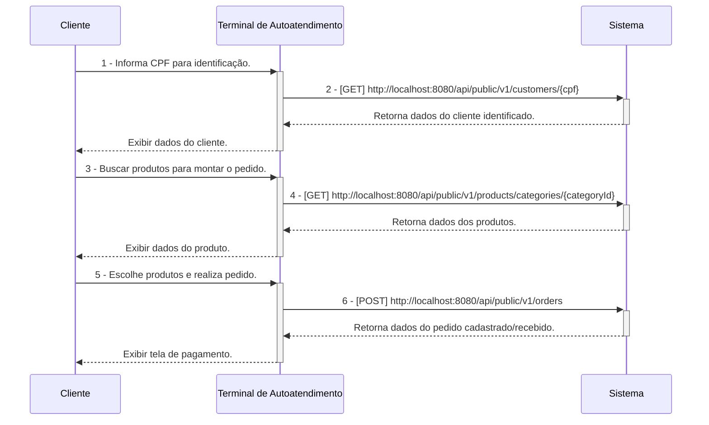
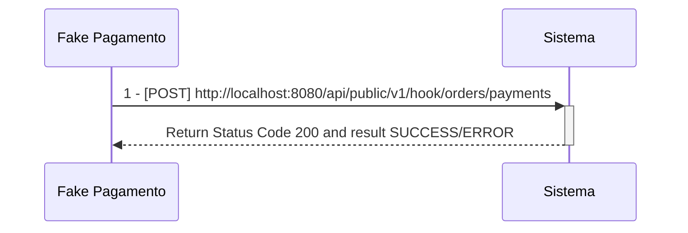
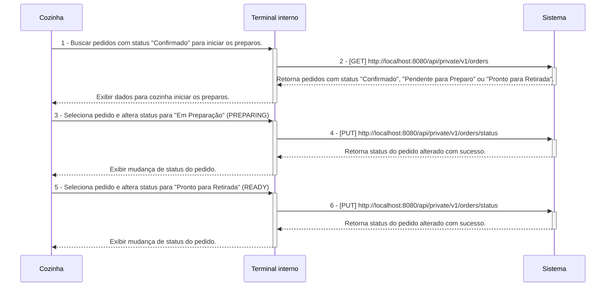
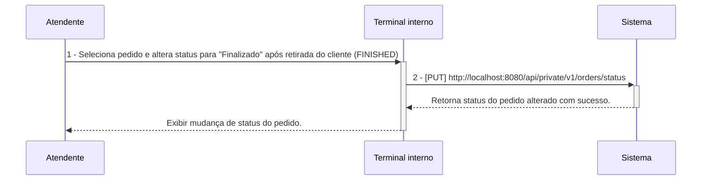

# Tech Challenge Backend API

## O Desafio :triangular_flag_on_post:

Uma lanchonete de bairro está em expansão devido ao seu grande sucesso. Entretanto, com essa expansão e a ausência de um sistema de controle de pedidos, o atendimento aos clientes pode tornar-se caótico e confuso. Por exemplo, imagine que um cliente faça um pedido complexo, como um hambúrguer personalizado com ingredientes específicos, acompanhado de batatas fritas e uma bebida. O atendente pode anotar o pedido em um papel e entregá-lo à cozinha, mas não há garantia de que o pedido será preparado corretamente.

Sem um sistema de controle de pedidos, pode haver confusão entre os atendentes e a cozinha, resultando em atrasos na preparação e entrega dos pedidos. Pedidos podem ser perdidos, mal interpretados ou esquecidos, levando à insatisfação dos clientes e à perda de negócios.

Em resumo, um sistema de controle de pedidos é essencial para garantir que a lanchonete possa atender os clientes de maneira eficiente, gerenciando seus pedidos e estoques de forma adequada. Sem ele, a expansão da lanchonete pode não ser bem-sucedida, resultando em clientes insatisfeitos e impactando negativamente os negócios.

Para solucionar o problema, a lanchonete irá investir em um sistema de autoatendimento de fast food, composto por uma série de dispositivos e interfaces que permitem aos clientes selecionar e fazer pedidos sem precisar interagir com um atendente, com as seguintes funcionalidades:

1. **Pedido**
    - Os clientes são apresentados a uma interface de seleção na qual podem optar por se identificarem via CPF, se cadastrarem com nome e e-mail, ou não se identificar. A montagem do combo segue a sequência a seguir, sendo todas as etapas opcionais:
        - Lanche
        - Acompanhamento
        - Bebida
        - Sobremesa

**Em cada etapa, são exibidos o nome, descrição e preço de cada produto.**

2. **Pagamento**
    - O sistema deverá possuir uma opção de pagamento integrada para o MVP, sendo a forma de pagamento oferecida via QRCode do Mercado Pago.
    - Nesse MVP, será realizado um `fake checkout` para o fluxo de pagamento, sem integração direta com o Mercado Pago.

3. **Acompanhamento**
    - Uma vez que o pedido é confirmado e pago, ele é enviado para a cozinha para ser preparado. Simultaneamente, deve aparecer em um monitor para o cliente acompanhar o progresso do seu pedido com as seguintes etapas:
        - Recebido
        - Em preparação
        - Pronto
        - Finalizado

4. **Entrega**
    - Quando o pedido estiver pronto, o sistema deverá notificar o cliente que ele está disponível para retirada. Ao ser retirado, o pedido deve ser atualizado para o status finalizado.

**Além das etapas do cliente, o estabelecimento precisa de um acesso administrativo:**

1. **Gerenciar clientes**
    - Com a identificação dos clientes, o estabelecimento pode trabalhar em campanhas promocionais.

2. **Gerenciar produtos e categorias**
    - Os produtos dispostos para escolha do cliente serão gerenciados pelo estabelecimento, definindo nome, categoria, preço, descrição e imagens. Para esse sistema, teremos categorias fixas:
        - Lanche
        - Acompanhamento
        - Bebida
        - Sobremesa

3. **Acompanhamento de pedidos**
    - Deve ser possível acompanhar os pedidos em andamento e o tempo de espera de cada pedido.

As informações dispostas no sistema de pedidos precisarão ser gerenciadas pelo estabelecimento através de um painel administrativo.

## Equipe :construction_worker:

- Myller Lobo
- Jean Carlos
- Caio Isikawa
- Vanderly
- Thiago

## Pré-Requisitos :exclamation:

- Maven 3
- Java 17 (Open JDK 17)
- Postgres 15
- Docker Desktop
- IntelliJ IDEA
- DBeaver SQL Client
- Postman

---

## Configuração de Ambiente de Desenvolvimento Local  :heavy_check_mark:

[Clique aqui para ser redirecionado para a wiki de configuração do ambiente de desenvolvimento local](https://github.com/fiap-8soat-tc-one/tc-backend-s2/blob/main/docs/config/README.md)

## Configuração do Ambiente Docker/Docker Compose :heavy_check_mark:

- **A aplicação está configurada para o Flyway gerar as tabelas no PostgreSQL. Abra o DBeaver ou a ferramenta de sua escolha e verifique se as tabelas do sistema foram criadas.**

[Clique aqui para ser redirecionado para a wiki de configuração do ambiente Docker](https://github.com/fiap-8soat-tc-one/tc-backend-s2/blob/main/docs/docker/README.md)

## Detalhamento sobre Stress Testing e Smoke Testing :heavy_check_mark:

- **Dentro da pasta scripts/tests contém todos os scripts k6 para efetuar a execução os cenários de smoke-test e stress-test que foram realizados para configurar de maneira efetiva o os requests/limits da aplicação juntamente com o HPA**

[Clique aqui para ser redirecionado para a wiki de testes](https://github.com/fiap-8soat-tc-one/tc-backend-s2/blob/main/tests/README.md)

## Manual/Documentação de Funcionalidades (Swagger/Open API) :heavy_check_mark:

- **Para todos os endpoints privados, é necessário gerar o token via endpoint login(POST /oauth/token)**

- **É possível acessar o Swagger/Open API da aplicação pela seguinte URL: `http://localhost:8080/swagger-ui/index.html`**

### Workflow de Execução das APIs

**Segue abaixo o descritivo simplificado da jornada das APIs dentro do sistema, esses diagramas servem apenas para materializar a jornada do ClienteXTerminalxSistemaXCozinha, mas em nenhum momento substitui o detalhamento/especificação realizados no Domain Storytelling e Event Storming criados, favor utiliza-los como fonte da verdade**

1 - **Criação do Pedido a partir de um cliente identificado**

**Observação:**

- **Os fluxos de 1 a 2 são opicionais.**
- **Não é necessário informar campo id_customer no payload do POST v1/orders uma vez que esse campo é opcional com base na escolha do usuário se identificar ou não.**

---

3 - **Pagamento do Pedido**

---

4 - **Acompanhamento e Preparação de Pedido na Cozinha**

---

5 - **Finalização do pedido**

[Clique aqui para ser redirecionado para a documentação das APIs e suas funcionalidades](https://documenter.getpostman.com/view/37556926/2sA3s1oXsw)

## Domain Storytelling :heavy_check_mark:

[Clique aqui para ser redirecionado para a documentação do domain storytelling](https://miro.com/app/board/uXjVKuUez2Q=/)

## Dicionário de Linguagem Onipresente/Ubíqua

| Palavra                         | Descrição                                                                                                                                                                                                     |
|---------------------------------|---------------------------------------------------------------------------------------------------------------------------------------------------------------------------------------------------------------|
| Lanchonete                      | Estabelecimento onde a solução/sistema será aplicado.                                                                                                                                                         |
| Cliente                         | Pessoa que realiza pedidos na lanchonete.                                                                                                                                                                     |
| Cozinha                         | Setor da lanchonete responsável por preparar todos os produtos do combo.                                                                                                                                      |
| Administrador/Usuário Sistêmico | Pessoa que cadastra produtos no sistema.                                                                                                                                                                      |
| Sistema de Controle de Pedidos  | Sistema que soluciona o problema da lanchonete, automatizando a coleta de pedidos, pagamento e comunicação com a cozinha.                                                                                     |
| Monitor/Terminal                | No Contexto da Cozinha: Display onde são exibidos os pedidos na cozinha pendentes de preparo. No Contexto do Cliente: Display onde o cliente consegue acompanhar o status dos seus pedidos.                   |
| Promoção                        | Oferta de produtos com desconto customizada por cliente.                                                                                                                                                      |
| Pagamento                       | Ação realizada pelo cliente ao fazer a leitura do QR code do Mercado Pago para realizar o pagamento do pedido.                                                                                                |
| Pedido                          | Pedido de combo realizado pelo cliente.                                                                                                                                                                       |
| RECEIVED/Pedido Recebido        | Pedido aguardando pagamento pelo cliente)                                                                                                                                                                     |
| PENDING/Pedido Pendente         | Status do pedido após uma falha no fluxo de pagamento.                                                                                                                                                        |
| PREPARING/Pedido Em Preparação  | Status do pedido após a após a conclusão do pagamento e encaminhamento para a cozinha iniciar o preparo.                                                                                                      |
| READY/Pedido Pronto             | Status do pedido após a cozinha terminar o preparo e disponibilizar para retirada pelo cliente.                                                                                                               |
| FINISHED/Pedido Finalizado      | Status do pedido após ser retirado pelo cliente.                                                                                                                                                              |
| CANCELED/Pedido Cancelado       | Status do pedido após ser cancelado pelo cliente ou pela cozinha.                                                                                                                                             |
| Acompanhamento                  | No Contexto de Itens do Pedido: Item que acompanha o hambúrguer, como, por exemplo, batata frita. No Contexto do Pedido: Funcionalidade que permite ao cliente acompanhar o status do seu pedido no monitor.  |

## Event Storming :heavy_check_mark:

[Clique aqui para ser redirecionado para a documentação do event storming](https://miro.com/app/board/uXjVK1Bf4Q4=/)

## Domain Mapping :heavy_check_mark:

## Desenho de Arquitetura/Infraestrutura  proposto  :heavy_check_mark:

[Clique aqui para ser redirecionado para o desenho de arquitetura e infraestrutura](https://viewer.diagrams.net/?tags=%7B%7D&lightbox=1&highlight=0000ff&layers=1&nav=1&title=tc-backend.drawio.png#R%3Cmxfile%20scale%3D%221%22%20border%3D%220%22%3E%3Cdiagram%20name%3D%22Draft%22%20id%3D%22jiXIkiBsy346j2COqR-b%22%3E7V1pc6M4E%2F41qZr5AIUEGPjoOPFkajK1mWT2nXc%2FpTAoNhuMvBw55tdvSxwGJHwkxvbMOs4BjQDR%2FfShVouc6aP5y6fYXcy%2BUp%2BEZ1jzX870izOMTV0z4Q%2BjvOYUjEw7p0zjwM9p2pJwF%2FwkORGV1CzwSVLQclJKaZgGiybRo1FEvLRBc%2BOYPjebPdDQbxAW7pQ0usEId54bEqHZj8BPZznVxtaSfkWC6ay8Mxo4%2BZG5WzYuLpzMXJ8%2B10j65Zk%2BiilN8635y4iEjHtNvow7jlYdi0mUbnICGX69%2BnZ37kxesuuraOT8jLS%2FFbO4zJMbZsUTF71NX0sWxDSLfMKuop3p58%2BzICV3C9djR59B6kCbpfMQ9hBsJmlMH8mIhjQGSkQjaHYudrW8LYlT8lIjFV3%2FROicpPErNCmOKqZenFMgScH2ICc8L%2BWCLb0gzmpCwcgqqG6Bhml1%2FSXDYKPg2Rb8M6xt%2BMcY5MZegXLE2Om7yazi7UMQhiXrzrA%2BNtmnYmqJPx0o09BNkvIsGqW1s%2FIvQRRwZMC%2F2Nmx6wdkedYOxWRgvSEmPNBEKZmmKUoJmVpvUtoK5aukhFpSKjgnCkhgvsa%2FCnHdFfeVKPHWLAeJNzhuWY7AcQRUkeOOjntiuG4J%2FCU%2B2NVil8bpjE5p5IaXS%2Bp5084s21xTuihY%2FzdJ09dCMG6WUpntqUvhIaTPwygAWxzQqGjVyfKEZrFHVjwVLlCbuvGUpKsevwAye%2BaVIoxJCF17avqanUuj7Pfm8F9j5GOalhx1BPVYY6xE5dmBDjiOo6JBQw0QfNTSztRUwTB1tdSQhpNwTNW2e5KAcxzq8Hbom7sGdHHqDQ2gK5UcUdvJDxzVbF4kV77ivJZYqo68XVJbqcoG8VDLpT%2BY7PMmp71GyXbhvHUDN9mPBkj03ghLnLet92W81gsEIusF2wQ7z%2BBZZz97%2BACi%2BWEYTJm5SpnuVNRrd0LCG5oEhTGb0DSlc2gQsgPnrvc45cKuC5B%2FQRN%2Bs2GyyAcdDAluufMQvDBBnRf9uZilKRutDBkj8NjzI0MNYLzyEACMYtWDO%2BKx76Yu%2FGH0hPEpyJRJCB1QEuoFbsjYMGah1HgapLNsoiBsq4to2h8UTKsFBVuEgiEJto2%2BgjhdAMKnIL3KJkAbekyAiQAMeNi0iQe3wIEHrCGxBCDzwPe5%2BZXpdVPzeSCXG18sBna9Cabl5xgSRB3VDFEyutaTZIztVfStGuiTBzcL007NlutgQ03lWvkEDWicEPJYKOTzQgFdTJmk8DhbhNT1mWJijQ1wxhp49HGOP6VAn3IN%2Fln5H7%2BOmjxNlX71UzdbMCiHAfWwHyGJqUZ9xZkDAQejz3ChEWxpN8GChAHEe%2F8JHRX8qLGZG%2B1NRTdIUyxYSMXva57Dt6YyhI00%2FmNCgxEnOjYjqCxvVKPzPdVCrcYDuO2oRcxbOqaEOqiI8L2BjUgeSerNCkmvdfqCaRBwxjlA4ssnkjOCA6QwXPOXKctwql6QeBQ5apbwU1rhnaaZmiWGcZ1Zgh2AzUFOO2YTwYYMWcLFMHtCW5m8rcHtlkwDeH6IcbTPzACDidUiCr9GoJEuGIYYtotGr4cwEr0bBactJyT6beRI%2FLbRl1EoHUHDKgy4d4WoajBN%2BZPnBMajhkwG%2F2S0PKAk3MSCK9WASy%2F5acXx8kIX1HvkQr76s7oo9Dq%2FbvNeQK7d%2F1cP9rW1wX4R4s%2BJH7gKRix2G2OjOnDPD9w3dkKINe59ztK%2BhwJIt9vODIvALYPQhoHBfeVTSt8pQe67gfpnkp2N9LMhigOarEGqHzy961476%2FSHHwRUZvydpsyyjr%2FSSQBXgpHRYvFxvbbxx%2BjQt9%2FA9NoDvYVgMUOOTUmCvPSku8fvQfLjsmy4bObCjdMhmzplMmap28AryeMgLC%2FWKZe12XG08%2By4PJloaM0UholaOao869lbKhHJxsU70nfBT3%2BOpjFJwF5pX90IPJEvd6a%2FhjUTnu4aRt9wApgeN%2FJYFLH1s62xco2hRHskJBkGYdnYSEazRCISm4nDpPwObaKMZolE1DHswrJRl4xmmWKP22cjydmodTYfx9EsZSP%2FUVWhIZm0hs%2BYqVZ7QHV5YSE%2BayrkxavYrDGDvjbY6xgbtl1a3WouUwgQdjRdljQSbA8Z3efEUEE5ubX57LH%2BnMNuvtVsBQYvge7ds2zT%2FYSjPegvstP15pBEl6QpkKygoiLu3jGah3CMwML49f%2FsfNUsd%2F8qLsd3Ll4ae6%2F1vRsSB%2FDwDDYXmlRUcr%2F7Pi%2B7dsauDJHXu2Nj1%2B74fQg4krnSPoS2Xhb2YUIjsLGtULfv2EjMFe8hNtoiamhBUDTyHbnHhjfi45%2BkOf55o4dq%2BUVsW%2BYlXukXhXyuppl5mlVvRRCFe29neqVUaU7Y6biwxc9WHWeDMAbbrbY8dmj70sdsQuIIrG3CsyqMA4u48KR79JQ23thTwtP25SzLThzaVNbcp2FV%2FpQ5UKRqqGqxjRPdbeFWaVbX2l%2B88zqX9%2FlCe49W8o7ETwGwsaTHVW7JXSyU1FMmrvdIIl9JsJI8eR9P5vT3Nqcg432ZU4QtyeT1%2Fu2pOG3Vn7qJSjVbuCed%2Bi11akniLC3kUGkaE3xfkze4LNsqVc1EYkH%2BAVRtn1OPN39cJKJb66a8ZVrypH1Hq32Vni2o35ueIdNWtVYFum4eharJ5kpP6D2hdw16MRbX1x0AvWLZ7wm9J%2FSuR69sFdz%2B0dud5uyabF05dNgiCNImVUWT4uUIZMeDCDDthtIbiUMSnyzWDElWTaqe9PJo9XLNiATkHtJXqcIKU6V9abAmWbx3AA2WVU7n6AeMRu8al9wSkA8r2fBZqdYtTYk7BybSmnrl95CUaTRJ7%2B7Kh1uapSyBDv3IQpJ8XNOHoyoaqy1HbS8xXa4X2WzBXVGpvW5Ba2%2Fr57FhqGUSulQEpBkVvmu6oGOzXBvZWNTdV7Uw7k5G70AT%2FsmCJOB1lxb7fW4SphhX37%2FffLjrBuNBYSdFjhx8vcQ9hm00gFKN9A5W1qh3Z3VOxvJIULvCWNZfOfKrmEtLYi71YzCXumzguiMAjmbu3PXZWhqflahrEK0XgStbdLB3fbglKY35Yp68O77rNyrnTzqxT50YtFaGIuwcRfygd5dD7wCBfhATD0RYOgXGQ5ePd3ntD1%2FLG9Mw5EuQ%2BDK%2FArDw60s1GIKdD5dfjjXg%2BK1giga4AVPTEaeATQ3zYuL9YXSHZWkdCZh4OvmA2crLEWtc2%2FgoRfZw7v6kTDluL%2B42nQlupFm2qr7uEHd3vqSdYSkvtFFRdqUKbR2p0jqr6rJl%2BlOv1ZaG7NCcl4nlK11khdqLmPqZlxZ12lVGpFnM7Sd9BfXIMVqlmVjy4g1kSNaJ9veWO73Hod8fCwKGuj3w40E%2BSbw44CslQxKkGbfn3GoPf9yVGqEp8AOYSpmZv%2Ft2fbLc%2FVtus109rEtqCvYdXhiy8GKVYTyt8jmt8jnQKp%2FH3tzHwGpm0W3DVi3xPQOlS6lrZknbvWaK71TLDThE2vB7FGYJE8cBLHQub0O%2BamcX6QlktKQhmZQ05IbS6s1Qypx5i%2FcNbavXfoug11UvpJkv82q2qa9422zjHv28csOwtQb%2FsexVWQ6WhFK20xf3j3h5UyfLj%2BX1kEr5cu1SnuV7Zte8HHIYx%2B5rrVmZLOu8D9abZrQoJhhv2K9mc9jIO7DTFVRmd7Hyu2Pyi3z6F2ufo4fYJYCeLA%2B%2FjzG2PvQ0jIK1VsJN2%2BPrJYynL%2FfhlZ%2FakXntzr7h5Pt8rPRQXIvMDqwkxItJKqmvBbIPXA3cMFHYgPlUXPs7FpIsl4twHHQoj0TFVhSDoNbwEty4LIFtYlWTvHXI3D5wgt3l%2F2HIDfTy31nol%2F8C%3C%2Fdiagram%3E%3C%2Fmxfile%3E)

## Requisitos não funcionais a serem implementados no futuro

- Testes de Integração.
- Testes de Carga/Estresse.
- Cadastro de usuário sistêmico, hoje temos apenas um usuário sistêmico, via carga do flyway.
